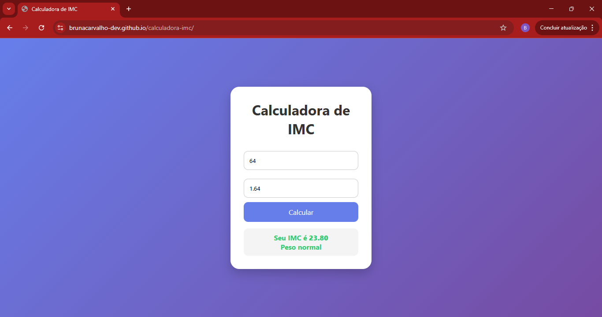

# calculadora-imc
Calculadora de IMC desenvolvida com HTML, CSS e JavaScript.

🚀 Funcionalidades
- Cálculo automático do IMC
- Design limpo e moderno

💻 Tecnologias 
- HTML5
- CSS3
- JavaScript
  
📸 Preview

  

🔗 Acesse 
 https://brunacarvalho-dev.github.io/calculadora-imc/
